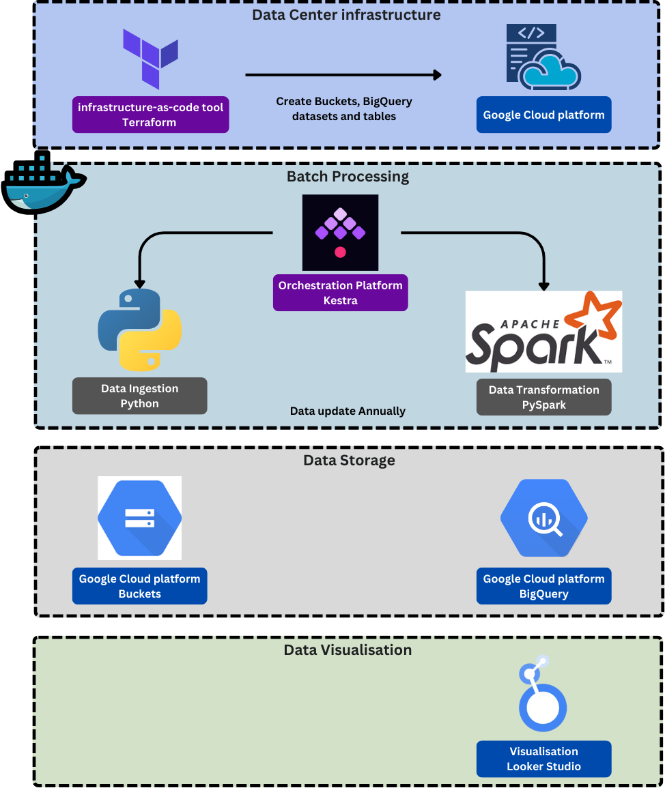

# Tracking Population Dynamics - Data Engineering Zoomcamp Project

## Problem Description

Our goal is to build an end-to-end **batch data pipeline** that ingests, transforms, and visualizes this data using modern cloud-based data engineering tools.

The global population datasets used in this project:
- Life Expectancy
- Birth rates
- International migration by country
- Refugees

---

## 🚀 Tech Stack

| Component              | Technology Used                |
|------------------------|--------------------------------|
| Cloud Platform         | Google Cloud Platform (GCP)    |
| Infrastructure as Code | Terraform                      |
| Orchestration          | Kestra                         |
| Data Lake              | GCP Cloud Storage (Buckets)    |
| Data Warehouse         | BigQuery                       |
| Data Transformation    | PySpark                        |
| Dashboard              | Google Looker Studio           |

---
## Overview

---

## ☁️ Cloud Infrastructure

Infrastructure as Code tool **Terraform**:
- 1 Cloud Storage bucket with four folders: `birth_rate/`, `life_expectancy/`, `migrant/`, `refugees/`
- 1 BigQuery dataset: `PopulationMigrationWorld`
- 2 BigQuery tables:
  - `dim_country` : Static metadata about countries
  - `fact_population` : Time-series population data

The fact_population table is:
- Partitioned by the year column
- Clustered by the country_code column

---

## 🛠️ Data Pipeline Overview

This is a **batch pipeline** scheduled via **Kestra** to run automatically.

### 1. Ingestion
- A [**Python script**](./python/data_ingestion.py) downloads population-related datasets (e.g., from UN or World Bank).
- Files are uploaded to the `birth_rate/`, `life_expectancy/`, `migrant/`, `refugees/` folders in a GCS bucket.

### 2. Transformation
- A [**PySpark job**](./python/pyspark_ETL.py) reads raw CSV data from GCS.
- Performs cleaning and transformation into a star schema format:
  - `dim_country`: Static country metadata
  - `fact_population_stats`: Time-series data on life expectancy, birth rate, migration, refugees

> The transformed data is written into BigQuery, with **partitioning on** year and **clustering on** country_code, configured through Terraform. This structure enables performant analytical queries with minimal scan costs.

### 3. Orchestration
- Orchestrated with **Kestra**:
  - Manages sequential execution of ingestion and transformation.
  - Triggered on a **yearly schedule**.

#### pipeline map in Kestra:

---

## 📊 Dashboard

**Tool Used**: Google Looker Studio

🔗 [View the Dashboard](https://lookerstudio.google.com/reporting/52ea6e84-c6a3-4042-ad1d-e8a9187283a1)

The dashboard includes:

-  **Filters**:
    - Year
    - Country
-  **World Map**: Visualizes country-level metrics (e.g., life expectancy)
-  **Bar Chart 1**:
    - Top 10 Countries by Life Expectancy
    - Side-by-side comparison with Birth Rate
- **Bar Chart 2**:
  - Top 10 Countries by Number of International Migrants Originating From**  
  *(i.e., countries people are emigrating from the most)*

> Charts include clear titles, interactive filters, and tooltips for easy data exploration.

---

## References:

